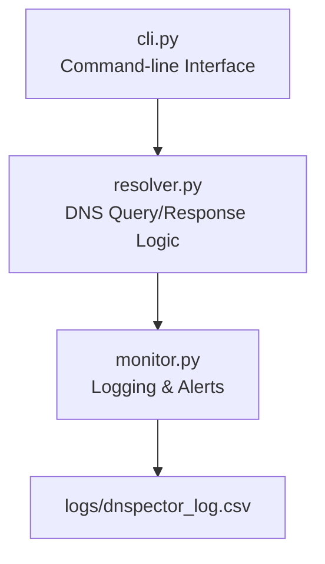

# DNSpector

DNSpector is a Python-based DNS inspection and monitoring tool—a modern, extensible alternative to `dig` or `nslookup` with built-in monitoring and logging features. It is designed for network engineers, sysadmins, and curious developers who want deep, scriptable insight into DNS resolution and performance.

---

## Features
- **Manual DNS Querying:** Sends raw DNS queries (UDP) to public DNS servers (e.g., 8.8.8.8), constructed and parsed manually (no external DNS libraries).
- **Detailed Response Parsing:** Extracts A record IP, TTL, and response code (NOERROR, NXDOMAIN, etc.).
- **Performance Monitoring:** Measures and logs DNS response time (latency), timestamp, and errors (timeouts, invalid responses, etc.).
- **Structured Logging:** Outputs results to `logs/dnspector_log.csv` with headers: Domain, IP, TTL, Status, Response Time, Timestamp.
- **Modular Design:**
  - `resolver.py`: DNS query/response logic
  - `monitor.py`: Latency logging and alerting
  - `cli.py`: Command-line interface and argument parsing
- **Clear Inline Comments:** Code is well-documented for learning and extension.

---

## Tech Stack
- **Python 3.x**
- **Core Networking Modules:** `socket`, `struct` (manual packet crafting/parsing)
- **Performance & Monitoring:** `time`, `logging`, `csv`
- **Protocol-Level Understanding:** Direct manipulation of DNS over UDP (no abstraction libraries)
- **Extensible for Advanced Networking:**
  - Can integrate with `scapy` for custom packet analysis
  - Ready for use with `asyncio` for high-performance, concurrent DNS monitoring
  - Easily extendable to support protocols like TCP, TLS (DoT), or HTTPS (DoH)
- **Data Engineering Ready:**
  - Structured logging for downstream analytics (CSV, JSON, SQLite)
  - Modular for integration with visualization tools (e.g., matplotlib, Grafana)

This stack demonstrates hands-on skills in low-level networking, protocol analysis, and data engineering—ideal for network/data communications roles.

---

## Architecture

- **cli.py:** Accepts domain input, orchestrates query and logging.
- **resolver.py:** Crafts and parses DNS packets, handles UDP communication.
- **monitor.py:** Measures latency, logs results, manages alerts.

---

## Practical Use-Cases
- Troubleshoot DNS issues with raw, scriptable queries
- Monitor DNS latency and reliability over time
- Detect DNS poisoning, hijacking, or propagation delays
- Compare DNS performance across providers
- Automate DNS health checks in CI/CD or monitoring pipelines

---

## Future Enhancements
- Support for AAAA (IPv6) records
- Compare multiple DNS providers (e.g., 8.8.8.8 vs 1.1.1.1)
- Alerting on IP/TTL changes
- Export logs to JSON or SQLite
- Visual graphs for DNS latency and trends
- More record types (MX, CNAME, etc.)
- Configurable alert thresholds and notification channels

---

## Benefits
- **No External Dependencies:** Lightweight, portable, and easy to audit.
- **Educational:** Learn DNS internals by inspecting and modifying raw packets.
- **Extensible:** Modular codebase for easy feature addition.
- **Scriptable:** Integrates into automation and monitoring workflows.

---

## Getting Started
1. Clone the repo
2. Run `python cli.py --help` for usage instructions
3. Inspect logs in `logs/dnspector_log.csv`

---
